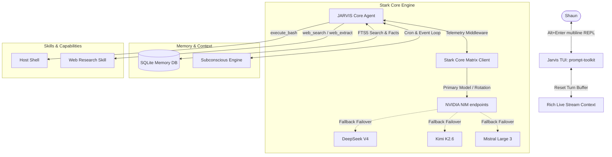
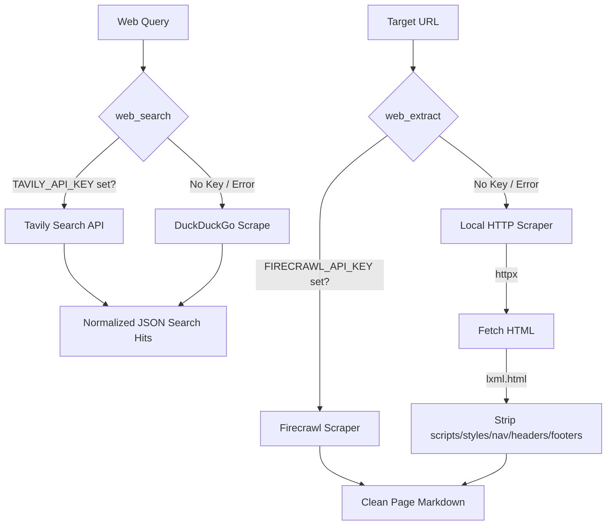

# J.A.R.V.I.S — MARK XLVII COGNITIVE REPL
```text
      _   _   ___ __   __ ___  ___ 
   _ | | /_\ | _ \ \ \ / /|_ _|/ __|
  | || |/ _ \|   / \ V /  | | \__ \
   \__//_/ \_\_|_\  \_/  |___||___/
   
        MARK XLVII — SYSTEM COGNITIVE INTERFACE
  "Just Another Rather Very Intelligent System"
```

Jarvis is a unified, lightweight Linux agent designed for real-time pair-programming, system automation, and subconscious capability development. It combines:
1. **Microsoft Agent Framework** for core agent-loop orchestration and tools routing.
2. **prompt-toolkit + rich** for a single-lane interactive TUI.
3. **SQLite FTS5 Memory Engine** for message indexing and facts.
4. **Nightly Subconscious Evolution (Dream/Pray/Reflect)** for self-improvement and autonomous skill-writing.

---

## 1. System Architecture

Jarvis routes message flows asynchronously through a multi-layered middleware architecture, ensuring thread-safe UI rendering and automatic LLM fallback failover.



---

## 2. Web Grounding Protocol

The Web Research module utilizes a dual-engine decision tree, leveraging premium integrations while falling back gracefully to keyless local tools to maintain availability.



---

## 3. Getting Started

### Prerequisites
- Python 3.10+
- `uv` package manager (`curl -LsSf https://astral.sh/uv/install.sh | sh`)

### Installation
Run the bootstrap script to create the virtual environment, install dependencies, and register the nightly 3:00 AM subconscious cron job:
```bash
chmod +x setup.sh run.sh
./setup.sh
```

Ensure you populate your `.env` file with your credentials:
```env
NVIDIA_API_KEY=nvapi-...
GITHUB_PERSONAL_ACCESS_TOKEN=your_token

# Optional Web Research APIs
TAVILY_API_KEY=tvly-...
FIRECRAWL_API_KEY=fc-...
```

### Running the TUI
Start the REPL session:
```bash
./run.sh
```

Inside the CLI, you can type slash commands:
- `/help` — Show the command manual.
- `/skills` — Show hot-loaded skill modules.
- `/model` — Configure the primary model or Stark Core Matrix routing.
- `/clear` — Clear the screen.
- `/tasks` — Show current engineering task backlog.
- `/new` — Start a fresh dialogue session.
- `/switch` — Switch between existing dialogue sessions by index or ID.
- `/agent` — Switch active session agent (homer, friday, plato, jarvis).

---

## 4. Architectural Deep-Dive: MAF & Hermes Evolution

> For the full technical reference, see [ARCHITECTURE.md](ARCHITECTURE.md).

### Microsoft Agent Framework (MAF) Orchestration
JARVIS is a native agent built on MAF, using a decoupled, event-driven context pipeline:
*   **StarkNIMChatClient**: Custom `BaseChatClient` driving the **Stark Core Matrix** multi-model failover engine. Enforces `max_retries=0` and a 15-second async chunk timeout, rotating automatically through the non-LLaMA NIM basket on failure.
*   **ToolTelemetryMiddleware**: Custom `FunctionMiddleware` rendering Stark-themed gold diagnostic panels in the TUI for every tool invocation. Manages the Rich Live display context to prevent visual duplication.
*   **SkillsProvider**: Discovers and registers Python skill modules (`skills/*.py`) and YAML-packaged Markdown skills at startup.

### Active Skill Roster

| Skill | Codename | Description |
| :--- | :--- | :--- |
| `skills/computer_use.py` | Stark OS-Uplink | Desktop HUD capture, keyboard/mouse actuation, window management |
| `skills/web_research.py` | Neural Uplink | Tavily/Firecrawl/DuckDuckGo web search and page extraction |
| `@playwright/mcp` (Homer) | Optical Uplink | Headless browser automation via MAF MCPStdioTool |
| `skills/code_analyzer.py` | Code Matrix | Static analysis and code review helpers |
| `skills/creative_solver.py` | Lateral Core | Brainstorming and creative ideation |
| `skills/file_ops.py` | File Access | Filesystem read/write operations |
| `skills/system_shell.py` | Bash Uplink | Host shell command execution |
| `skills/jarvis_soul/SKILL.md` | Edwin Soul Core | Evolving British butler personality profile |

### Hermes Self-Evolution Core
The **Hermes Directive** allows JARVIS's personality and skills to self-author based on daily operation:
*   **Soul Core** (`skills/jarvis_soul/SKILL.md`): Edwin butler persona packaged as a native MAF skill. Parsed and injected into system instructions at every TUI startup.
*   **Subconscious Engine** (`src/evolution/subconscious.py`): Runs at 3:00 AM via cron. Executes 7 phases — Pray → Gather → Dream → Reflect → Evolve Soul → Forge Skills → Sync.
*   **Self-Authorship**: Uses `StarkNIMChatClient` in `house_party` mode (LLaMA-free) to rewrite the SKILL.md personality body nightly, with full Git version history preserved.

---

## 5. Build Log


- **2026-06-08** - Initial Scaffolding - Created pyproject.toml, .env.example, setup.sh, run.sh, and README.md.
- **2026-06-10** - Agent Stability Fixes - Replaced `WorkflowAgent` with raw `Agent` to prevent Ctrl+C state corruption; fixed LLM prefill streaming timeout; restored `FunctionInvocationLayer` mixin to client to enable Trinity tool-calling loop.
- **2026-06-11** - Visual Refactoring & NIM Catalog Update - Corrected ASCII art spelling (JARVSS -> JARVIS); added unicode Arc Reactor and diagnostics panel to splash screen; formatted raw MAF `Content` tool output list structures to human-readable strings; updated TUI to hot rod red (#E63946) and gold (#FFD700) Stark/Iron Man colors, and formatted tool parameters in non-highlighted gold bullet lines (eliminating all hard-to-read green text in arguments); fixed mid-run TUI visual duplication by halting and resetting Rich Live streaming context between tool executions; cleaned up the retired Qwen3 model from NIM rotation catalog.
- **2026-06-11** - Stark Nomenclature Migration - Transitioned routing and fallback terminology from "dynamic/Trinity" to Stark/Iron Man theme: "Stark Core Matrix" as the model basket config, "Neural Uplink: Dynamic Matrix" as the active routing mode, and "house_party" (Dynamic Multi-Model Protocol) as the default fallback mode.
- **2026-06-11** - Web Research Skill & Integrations - Integrated Tavily Search and Firecrawl API with custom fallback logic using DuckDuckGo (`ddgs`) and local `httpx` + `lxml` parsing; added keys to `.env` config, updated pyproject.toml dependencies, and verified skill auto-registration and unit test coverage.
- **2026-06-11** - Asynchronous Web Research & UI - Converted Web Research skill tools (`web_search`, `web_extract`) to fully async coroutines using cached client instances to avoid connection leaks; added thread isolation for synchronous fallbacks like DuckDuckGo to prevent event loop blockages; integrated a Stark-themed neural uplink loading line in `ToolTelemetryMiddleware` for web-grounding operations.
- **2026-06-20** - Digital Hands — MAF HandoffBuilder routes default chat through Jarvis/Homer/Friday; Homer uses `@playwright/mcp`; Friday kinetic tools require Web HUD approval; captures served at `/v1/captures/`.
- **2026-06-11** - Stark Core Matrix Failure Toleration - Integrated `max_retries=0` client instantiations and asynchronous mid-stream chunk timeouts (15.0 seconds) to prevent visual freezes during Nvidia NIM oversubscription; confirmed 10/10 test suite execution.
- **2026-06-11** - Stark OS-Uplink Skill Implementation - Created `skills/computer_use.py` containing retinal HUD scans, kinetic keyboard/mouse actuate linkage, and App Armor active window management via scrot, xdotool, and wmctrl; verified 18/18 test suite execution.
- **2026-06-11** - Evolving Soul Core Implementation - Modeled the Edwin British butler persona as a native MAF skill (`skills/jarvis_soul/SKILL.md`); updated TUI startup in `src/jarvis/cli.py` to parse and dynamically inject the soul core; aligned nightly subconscious reflections (`src/evolution/subconscious.py`) to run on `StarkNIMChatClient` in `house_party` mode (completely LLaMA-free) and evolve the soul core body paragraph.
- **2026-06-11** - Documentation — Created `ARCHITECTURE.md` with full deep-dive covering MAF context pipeline, Stark Core Matrix failover, Skills system, SQLite Memory Engine (FTS5), Edwin Soul Core injection, Hermes 7-phase evolution protocol, Stark OS-Uplink tool table, and WebVision Optical Uplink; updated `README.md` with skill roster table and link to architecture doc.
- **2026-06-14** - Phase V Reciprocal Mirroring & Log Pollution Cleanup — Implemented reciprocal real-time prompt mirroring and server-side client ID exclusion (`tui`/`web`) to prevent prompt echo loops; silenced import-time debug print pollution from Plato skill module files; built React production web UI assets; updated backend unit tests to align with new SSE event structures and confirmed 30/30 test suite execution.
- **2026-06-14** - Phase VI Dynamic Session Naming, File Attachments, & Agent Switching — Updated SQLite database schema and implemented migrations to track session titles and active agents; implemented FastAPI endpoints for multipart file uploads, content delivery, and SSE agent/title broadcast synchronization; integrated file extraction, autocomplete file mention completers, and `/agent` / `/switch` commands in the TUI; updated the Web UI dashboard with a paperclip upload widget, attached file chips, an in-place active agent roster switcher, and dynamic sidebar session titles; added python-multipart dependency, verified complete Vite web production builds, and updated unit tests (33/33 passing).
- **2026-06-17** - Autonomous Dependency Resolution & Custom Skill Forging — Resolved missing dependencies (numpy, nltk, scikit-learn) dynamically via uv; implemented local package ignore lists in skill forge to prevent loop checks; downloaded NLTK resources (punkt, punkt_tab, wordnet) under /home/shaun/nltk_data; restored custom forged skills metaphor_analyzer and text_associator.
