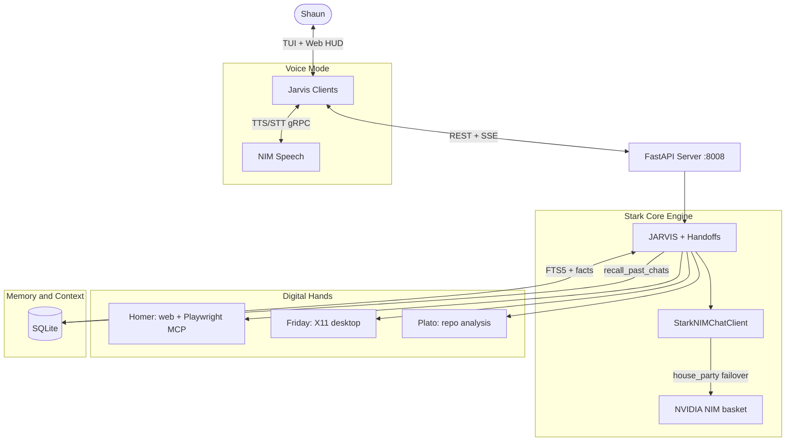

# J.A.R.V.I.S — MARK XLVII COGNITIVE REPL

```text
      _   _   ___ __   __ ___  ___ 
   _ | | /_\ | _ \ \ \ / /|_ _|/ __|
  | || |/ _ \|   / \ V /  | | \__ \
   \__//_/ \_\_|_\  \_/  |___||___/
   
        MARK XLVII — SYSTEM COGNITIVE INTERFACE
  "Just Another Rather Very Intelligent System"
```

Jarvis is a unified Linux agent for real-time pair-programming, system automation, and subconscious capability development. It combines:

1. **Microsoft Agent Framework** — agent-loop orchestration, tools, and handoffs
2. **prompt-toolkit + Rich** — interactive TUI
3. **SQLite FTS5** — message indexing, session memory, and cross-session recall
4. **Digital Hands** — Jarvis triages to Homer (web), Friday (desktop), and Plato (code)
5. **Nightly Subconscious Evolution** — Pray/Dream skill staging with human approval

---

## Quick start

```bash
chmod +x setup.sh run.sh
./setup.sh
cp .env.example .env   # set NVIDIA_API_KEY at minimum
./run.sh
```

Web HUD: **http://127.0.0.1:8008**

See [docs/GETTING_STARTED.md](docs/GETTING_STARTED.md) for full installation and first-session guide.

---

## Architecture overview



**Stark Core Matrix** rotates through non-LLaMA NIM models on failure: DeepSeek V4 Pro/Flash, Nemotron 3 Ultra, Kimi K2.6, Step 3.7 Flash. Default mode is `house-party` (dynamic multi-model failover).

---

## Specialist roster

| Agent | Role | Key tools |
|-------|------|-----------|
| **Jarvis** | Butler, triage, handoffs | Root skills, `forge_skill`, `recall_past_chats` |
| **Homer** | Web research | `web_search`, `web_extract`, Playwright MCP |
| **Friday** | Desktop automation | `computer_use.py`, `app_launcher.py` (X11) |
| **Plato** | Code/repo analysis | `code_analyzer.py`, `repo_reader.py` |

Full skill layout: [docs/SKILLS.md](docs/SKILLS.md)

---

## TUI commands

| Command | Description |
|---------|-------------|
| `/help` | Command manual |
| `/new` | Fresh session (finalizes previous memory) |
| `/switch [id\|index]` | Switch session |
| `/agent <jarvis\|homer\|friday\|plato>` | Switch agent |
| `/voicemode [on\|off]` | Toggle butler voice |
| `/models` / `/model` | List/set cognitive model |
| `/subagents` | Sub-agent profiles |
| `/skills` | Loaded skill modules |
| `/evolve [approve\|reject\|archive\|show]` | Review staged skills |
| `/tasks` | Task backlog |
| `/clear` | Clear screen |
| `/exit` | Exit |

---

## Documentation

| Guide | Contents |
|-------|----------|
| [GETTING_STARTED.md](docs/GETTING_STARTED.md) | Install, run, first session |
| [CONFIGURATION.md](docs/CONFIGURATION.md) | Environment variables, deps, cron |
| [ARCHITECTURE.md](docs/ARCHITECTURE.md) | MAF, memory, voice, handoffs — full deep-dive |
| [API.md](docs/API.md) | REST + SSE endpoint reference |
| [SKILLS.md](docs/SKILLS.md) | Subagents, tools, forge, staging |
| [WEB_HUD.md](docs/WEB_HUD.md) | React HUD tabs, voice, approvals |
| [EVOLUTION.md](docs/EVOLUTION.md) | Pray/Dream subconscious protocol |

---

## Build log

- **2026-06-08** — Initial scaffolding: pyproject.toml, setup.sh, run.sh, README
- **2026-06-10** — Agent stability: raw `Agent`, streaming timeout fixes, tool-calling loop restored
- **2026-06-11** — Stark theme, web research skill, OS-Uplink, soul core, ARCHITECTURE.md
- **2026-06-14** — Reciprocal TUI/Web mirroring; session naming, file attachments, agent switching
- **2026-06-17** — Autonomous dependency resolution; custom skill forging (text_associator, metaphor_analyzer)
- **2026-06-20** — Digital Hands: HandoffBuilder, Homer Playwright MCP, Friday approval-gated kinetic tools
- **2026-06-22** — Expert subagent souls with unified compiler; Digital Hands routing
- **2026-06-23** — Automatic session memory: recall, rehydration, session-end learning
- **2026-06-23** — Friday app launcher tools for Linux GUI apps
- **2026-06-22–07-02** — Handoff workflow fixes; validation harness; desktop video sensing; NIM failover improvements
- **2026-07-02** — Portable install: MAF deps from PyPI; Codespace startup fix
- **2026-07-06** — Documentation overhaul: `docs/` directory, updated architecture and API reference

**Tests:** 120 tests across 18 files (`pytest`)
