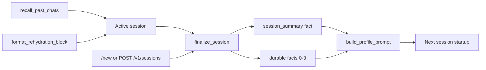
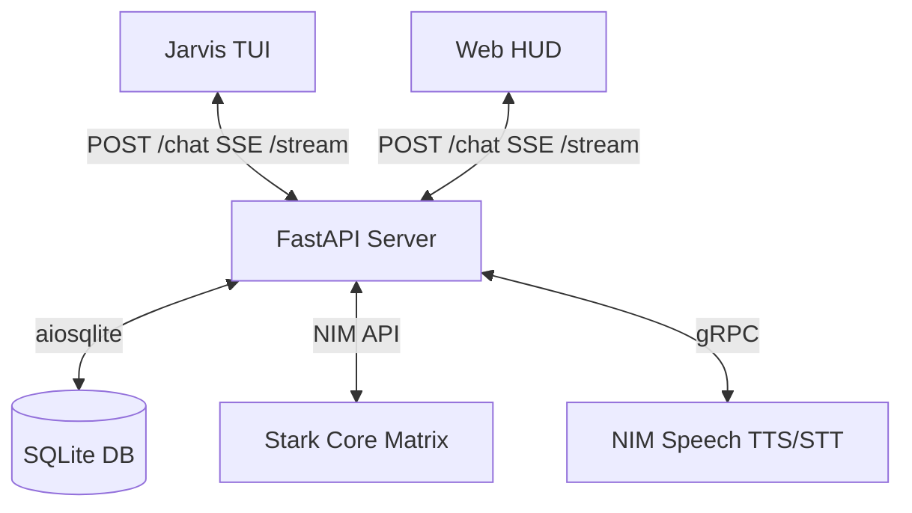

# J.A.R.V.I.S — Architectural Deep-Dive

**Mark XLVII Cognitive Interface — Internal System Documentation**

This document provides a detailed technical reference of the JARVIS internal architecture: Microsoft Agent Framework (MAF) integration, Stark Core Matrix failover, the Skills System, Memory Engine, Voice Mode, Digital Hands orchestration, and the Hermes Self-Evolution protocol.

For onboarding, see [GETTING_STARTED.md](GETTING_STARTED.md). For API details, see [API.md](API.md).

---

## 1. Microsoft Agent Framework (MAF) Integration

JARVIS is a native agent built on the **Microsoft Agent Framework (MAF)**, an open-source Python SDK for orchestrating multi-step LLM agents with tools, memory, and context providers.

### 1.1 The Core Agent Object (`src/jarvis/core/agent.py`)

```python
agent = Agent(
    client=StarkNIMChatClient(...),
    name="JARVIS_CORE",
    instructions=system_prompt,
    tools=[...skill tools...],
    context_providers=[...],
)
```

The `Agent` manages a turn-based agentic loop:

1. Collects the user's input message.
2. Calls `before_run` on all registered `ContextProvider` instances.
3. Sends assembled context to `StarkNIMChatClient` for LLM completion.
4. Intercepts tool call outputs via `FunctionInvocationLayer` middleware.
5. Calls `after_run` on all providers to process and persist the response.

### 1.2 StarkNIMChatClient (The Neural Uplink)

`StarkNIMChatClient` extends MAF's `BaseChatClient` with the **Stark Core Matrix** multi-model failover engine.

```
┌─────────────────────────────────────┐
│          StarkNIMChatClient         │
│                                     │
│  ┌─────────────────────────────┐    │
│  │  Stark Core Matrix Basket   │    │
│  │  - glm-5.2 (primary)        │    │
│  │  - minimax-m3               │    │
│  │  - nemotron-3-super         │    │
│  │  - deepseek-v4-flash-0731   │    │
│  │  - step-3.7-flash           │    │
│  └──────────┬──────────────────┘    │
│             │  house_party mode     │
│             ▼                       │
│  ┌──────────────────────────────┐   │
│  │  _stream_with_fallback()     │   │
│  │  • max_retries=0             │   │
│  │  • Ordered full-basket fail  │   │
│  │  • Auto-rotate on failure    │   │
│  └──────────────────────────────┘   │
└─────────────────────────────────────┘
```

Basket defined in `src/jarvis/config/models.py` (`NIM_MODEL_BASKET`). Subagents use the same ordered `SUBAGENT_MODEL_BASKET` (via house-party in each specialist `config.yaml`).

**Key design decisions:**

- `max_retries=0`: SDK must not retry internally. Retry logic is owned by `_stream_with_fallback()`.
- **Ordered house-party failover**: try every basket model in declared order on failure (no random sample, no last-success reordering).
- **Hard-fail fast**: EOL/`410`/`404` rotate immediately; non-primary attempts use shorter timeouts.
- **No LLaMA models**: Hard codebase constraint.

### 1.3 ToolTelemetryMiddleware

Custom MAF `FunctionMiddleware` wrapping every tool call:

- Logs tool name and arguments
- Renders Rich TUI gold diagnostics panel
- Stops/restarts Live streaming context to prevent visual duplication
- Shows `⬡ NEURAL UPLINK` loading lines for web research

### 1.4 SessionContext & ContextProvider Pipeline

MAF's `SessionContext` travels through `ContextProvider.before_run` hooks. Providers may:

- `context.extend_instructions(source_id, text)`
- `context.extend_tools(source_id, tools)`
- `context.extend_messages(source, messages)`

JARVIS uses this to inject the Edwin Soul Core persona (Section 4).

---

## 2. The Skills System

See [SKILLS.md](SKILLS.md) for the full directory layout and tool tables.

### 2.1 Root skill modules (`skills/*.py`)

Loaded at startup via `load_skills_from_dir(get_skills_dir())` in `src/jarvis/skills/skill_forge.py`. Functions decorated with `@tool` register as agent tools.

| Skill file | Description |
|------------|-------------|
| `skills/file_ops.py` | Filesystem read/write/list |
| `skills/system_shell.py` | Host shell execution |
| `skills/memory_recall.py` | `recall_past_chats` — FTS5 cross-session search |
| `skills/text_associator.py` | Semantic text association (scikit-learn) |
| `skills/metaphor_analyzer.py` | Metaphor analysis |

### 2.2 Subagent skill directories

| Directory | Tools |
|-----------|-------|
| `skills/homer/` | `web_search`, `web_extract` + Playwright MCP |
| `skills/friday/` | Stark OS-Uplink desktop tools, app launcher |
| `skills/plato/` | Code analyzer, repo reader |

### 2.3 MAF `SKILL.md` package skills

```
skills/jarvis_soul/SKILL.md   ← YAML frontmatter + personality body
```

Advertised by `SkillsProvider` and loadable via `load_skill("skill-name")`.

### 2.4 Skill forge (`forge_skill`)

Meta-tool in `src/jarvis/skills/skill_forge.py` for runtime skill creation. Part of Hermes Self-Evolution and manual agent use.

---

## 3. The Memory Engine (`src/jarvis/memory/memory_manager.py`)

Persistent context via SQLite (`data/jarvis.db`), managed by async `MemoryManager`.

### 3.1 Schema

```sql
CREATE TABLE sessions (
    id TEXT PRIMARY KEY,
    model TEXT,
    system_prompt TEXT,
    title TEXT,
    agent_id TEXT DEFAULT 'jarvis',
    started_at REAL NOT NULL,
    ended_at REAL
);

CREATE TABLE messages (
    id INTEGER PRIMARY KEY AUTOINCREMENT,
    session_id TEXT NOT NULL,
    role TEXT NOT NULL,
    content TEXT,
    tool_name TEXT,
    tool_calls TEXT,
    timestamp REAL NOT NULL,
    active INTEGER DEFAULT 1,
    FOREIGN KEY (session_id) REFERENCES sessions(id)
);

CREATE TABLE facts (
    category TEXT NOT NULL,
    subject TEXT NOT NULL,
    value TEXT NOT NULL,
    created_at REAL NOT NULL,
    PRIMARY KEY (category, subject)
);

CREATE TABLE preferences (
    key TEXT PRIMARY KEY,
    value TEXT NOT NULL,
    updated_at REAL NOT NULL
);
```

Migrations add `title` and `agent_id` columns to existing databases at startup.

### 3.2 FTS5 full-text search

Virtual table `messages_fts` indexes `content` and `tool_name` with insert/update/delete triggers:

```python
results = await memory.search_messages("computer use skill")
```

Falls back to `LIKE` queries if FTS5 is unavailable.

### 3.3 Profile compilation

`build_profile_prompt()` assembles preferences, recent session summaries (up to 3), and durable facts (up to 15, excluding `evolution` category) into a Markdown block injected at session startup.

### 3.4 Session memory lifecycle



**Finalize** (`src/jarvis/memory/extractor.py`):

- Triggered on `/new`, `POST /v1/sessions` (with `finalize_session_id`), or `POST /v1/sessions/{id}/finalize`
- LLM extracts 2–4 sentence summary + 0–3 durable facts from transcript
- Sets `sessions.ended_at`

**Rehydration** (`format_rehydration_block`):

- On server restart, restores last 12 turns into system context

**Recall** (`skills/memory_recall.py`):

- FTS5 search across all sessions when Shaun references past work

---

## 4. Expert Subagent Souls

Each specialist has a compiled soul markdown file and YAML config:

| Agent | Soul | Config |
|-------|------|--------|
| Jarvis | `skills/jarvis_soul/SKILL.md` | — |
| Homer | `skills/homer/homer_soul.md` | `skills/homer/config.yaml` |
| Friday | `skills/friday/friday_soul.md` | `skills/friday/config.yaml` |
| Plato | `skills/plato/plato_soul.md` | `skills/plato/config.yaml` |

Compiled via `src/jarvis/core/soul.py` (`load_compiled_soul`). Frontmatter fields include `role`, `version`, `output_contract`, `owns`, `forbidden`.

Subagents loaded by `src/jarvis/core/subagents.py` (`load_subagent`).

### 4.1 Edwin Soul Core (Jarvis)

Jarvis persona stored as MAF skill package. At startup, `src/jarvis/cli.py` and the server inject the soul body into system instructions under `# ACTIVE PERSONA PROFILE`.

Soul files are human-readable, version-controlled, and **not** auto-rewritten by subconscious jobs.

---

## 5. Hermes Self-Evolution Protocol

See [EVOLUTION.md](EVOLUTION.md) for full details.

Two cron jobs: **Pray** (2 AM), **Dream** (3 AM) in `src/evolution/subconscious/`. Staged skills reviewed via `/evolve approve|reject`.

---

## 6. Stark OS-Uplink (Friday Desktop)

Implementation: `skills/friday/computer_use.py` + `skills/friday/app_launcher.py`.

| Tool | Binary | Approval |
|------|--------|----------|
| `stark_os_retinal_hud` | `scrot` | No |
| `stark_os_kinetic_*` | `xdotool` | **Required** |
| `stark_os_armor_list_windows` | `wmctrl` | No |
| `stark_os_armor_list_apps` | `.desktop` index | No |
| `stark_os_armor_launch_app` | gtk-launch/gio | **Required** |
| `stark_os_armor_focus_window` | `wmctrl` | **Required** |

Captures: `GET /v1/captures/{filename}` from `webvision/`.

Headless guard: `src/jarvis/core/system_deps.py` skips desktop dep checks when `GITHUB_CODESPACES=true` or `DISPLAY` is unset.

---

## 7. Digital Hands Orchestration

MAF **HandoffBuilder** workflow in `src/jarvis/core/handoff_workflow.py`:

- **Jarvis** triages → hands off to specialists
- **Homer** — web research + Playwright MCP
- **Friday** — desktop automation (approval-gated kinetic tools)
- **Plato** — repo/code analysis

Friday kinetic approval flow: workflow pauses → SSE `approval_required` → `POST /v1/sessions/{id}/approve`.

Direct `/agent homer|friday|plato` runs single agent without handoff workflow.

---

## 8. Playwright MCP Optical Uplink

Homer browser tools from shared `MCPStdioTool` subprocess:

```
npx -y @playwright/mcp@latest --headless
```

Managed by `src/jarvis/core/playwright_mcp.py`. Requires Node 18+ and `npx playwright install`.

---

## 9. Voice Mode

NIM hosted speech via gRPC (`src/jarvis/voice/nim_speech.py`, config in `src/jarvis/config/voice.py`).

| Component | Detail |
|-----------|--------|
| TTS | NIM Magpie voices, default `Ray.Calm` at 0.92 rate scale |
| STT | 16 kHz PCM via NIM ASR |
| TUI | `/voicemode on\|off` |
| Web HUD | `useVoiceMode.ts` — push-to-talk + reply playback |
| API | `/v1/voice/status`, `/mode`, `/tts`, `/stt` |
| Preference | `voice_mode_enabled` in SQLite preferences (off at server boot) |

Text is cleaned of markdown, thinking blocks, and Rich markup before TTS (`clean_text_for_speech`).

Dependency: `nvidia-riva-client` (installed by `run.sh`).

---

## 10. Technology Stack

| Component | Technology |
|-----------|------------|
| Agent Orchestration | Microsoft Agent Framework (MAF) |
| Backend Server | FastAPI, Uvicorn, SSE |
| Web UI | React, TypeScript, Vite, Tailwind CSS v4 |
| HUD Graph | `@xyflow/react` |
| Web Console | `xterm.js` |
| LLM Endpoints | NVIDIA NIM (OpenAI-compatible) |
| Speech | NVIDIA NIM gRPC (Magpie TTS/ASR) |
| TUI | prompt-toolkit + Rich |
| Memory | SQLite (aiosqlite + FTS5) |
| Web Grounding | Tavily / Firecrawl / DuckDuckGo / httpx+lxml |
| Browser Automation | Playwright (Chromium via MCP) |
| Desktop Control | scrot / xdotool / wmctrl |
| Package Management | uv |
| Runtime | Python 3.10+ |

---

## 11. Client-Server Architecture



### 11.1 FastAPI server (`src/jarvis/server/app.py`)

Uvicorn on port 8008 (auto-increment if occupied). Serves `web/dist` at `/`.

Full endpoint reference: [API.md](API.md).

### 11.2 Reciprocal mirroring

1. Clients register `client_id` (`tui` or `web`) on stream and chat.
2. Chat submit broadcasts `user_message` to all SSE queues except sender.
3. Receiving client displays remote prompt passively (TUI uses gold `❯ {text}` styling with `patch_stdout()`).

### 11.3 Server daemon control

Via `python -m jarvis.cli server {start|stop|status}`. PID tracked in `data/server.pid`.

---

## 12. System Dependencies

Startup checks in `src/jarvis/core/system_deps.py`:

- **Desktop:** `xdotool`, `scrot`, `wmctrl` (skipped headless)
- **Node:** 18+ for Playwright MCP
- **Python:** auto-installed via pyproject.toml / run.sh

Never raises — logs warnings only.
